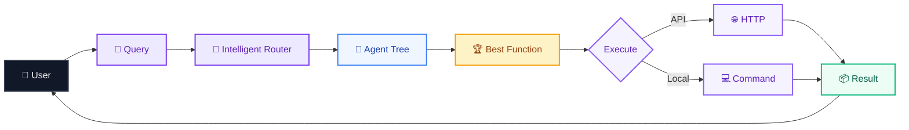
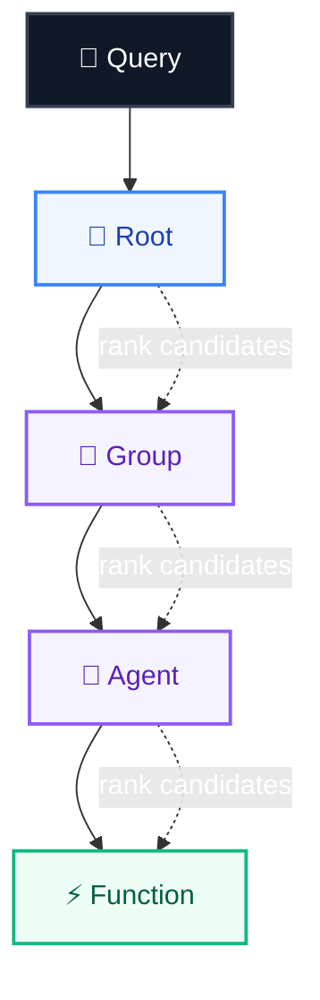
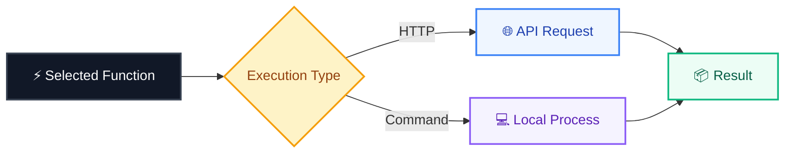
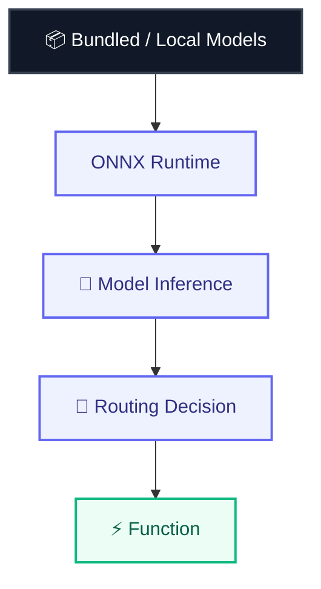
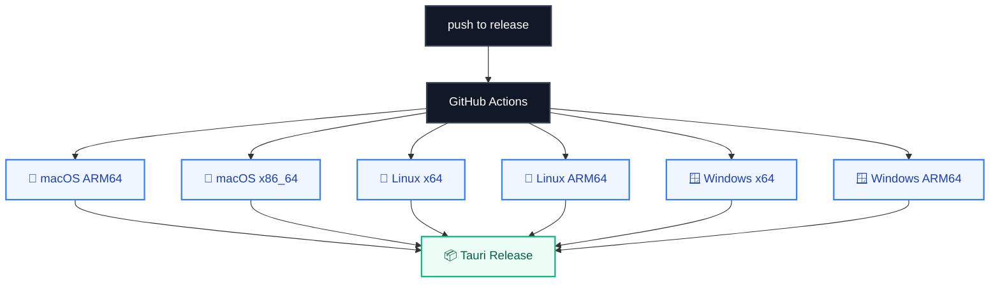

# QuickTasks Desktop

**QuickTasks Desktop** is a cross-platform Tauri application for loading a QuickTasks agent definition and performing **local model-backed intelligent routing**.

It combines a native Rust backend, local ONNX model inference, hierarchical function routing, and a desktop UI.

🌐 **Web:** https://qiktax.n8271435.workers.dev/

---

## Architecture



---

## Intelligent Routing

QuickTasks does not simply match a query against a flat list of functions.

The router moves through a **hierarchical agent tree** and repeatedly selects the most relevant child until it reaches the target function.



### Semantic candidate selection

At each level, the router combines each child node's **name and description**, sends the query/candidate pairs through a GTE cross-encoder, and selects the highest-scoring candidate.


This makes routing **semantic rather than dependent on exact function-name matching**.

---

## Execution

Once a function has been selected, QuickTasks can execute it through different execution paths.



---

## Desktop Runtime

The application uses **Tauri + Rust** for the native desktop layer.

```mermaid
flowchart LR
    A["🚀 QuickTasks"] --> B["Load Environment"]
    B --> C["Configure Runtime Paths"]
    C --> D["Initialize Tauri"]
    D --> E["Register Commands"]
    E --> F["🖥️ Desktop UI"]

    classDef start fill:#111827,color:#fff,stroke:#374151,stroke-width:2px
    classDef process fill:#eef2ff,color:#312e81,stroke:#6366f1,stroke-width:1.5px
    classDef end fill:#ecfdf5,color:#065f46,stroke:#10b981,stroke-width:1.5px

    class A start
    class B,C,D,E process
    class F end
```

The application exposes native commands for:

* status / initialization
* query routing
* agent loading
* model reloading
* application logs
* model file uploads
* direct local model file selection

---

## Local AI Inference

QuickTasks is designed around **local model assets** rather than requiring every routing operation to be sent to a remote inference service.



---

## Development

Run the desktop application locally with:

```bash
cargo tauri dev
```

---

## Distribution Builds

Build a native installer with:

```bash
cargo tauri build
```

Tauri builds native installers for the current operating system.

For full distribution coverage, builds are performed on the respective target platforms:

| Platform | Output                                       |
| -------- | -------------------------------------------- |
| macOS    | `.app` / `.dmg`                              |
| Windows  | Windows installer artifacts                  |
| Linux    | Linux bundle artifacts supported by the host |

---

## Bundled Models

The application can package the `models/` directory as a read-only Tauri resource.

For an offline-ready installer, place the following files in the repository:

```text
models/
├── crossencoder/
│   ├── model.onnx
│   └── tokenizer.json
│
└── ner/
    ├── model.onnx
    └── tokenizer.json
```

At runtime, QuickTasks copies bundled model resources into the user's writable application-data directory before loading them.

This allows the application to work with installed application bundles without attempting to modify read-only resource locations.

When model assets are not bundled, QuickTasks can download the default model files during the first model load and store them in the same writable application-data directory.

The desktop UI can also point individual model assets directly to existing local files. In that mode, QuickTasks validates the selected path and loads the ONNX model or tokenizer JSON directly without copying the large file into application data.

---

## Configuration

Environment overrides are supported for development, testing, and managed installations:

```text
QUICKTASKS_MODEL_DIR
QUICKTASKS_BUNDLED_MODEL_DIR

QUICKTASKS_GTE_MODEL_PATH
QUICKTASKS_GTE_TOKENIZER_PATH

QUICKTASKS_GLINER_MODEL_PATH
QUICKTASKS_GLINER_TOKENIZER_PATH

QUICKTASKS_CONFIG
```

---

## Cross-Platform Release Pipeline

QuickTasks uses GitHub Actions to build and publish Tauri releases across multiple operating systems and CPU architectures.



The release workflow supports:

* macOS ARM64
* macOS x86_64
* Linux x86_64
* Linux ARM64
* Windows x86_64
* Windows ARM64

Releases are triggered manually or by pushes to the `release` branch.

---

## Windows ARM64 ONNX Runtime

The Windows ARM64 build includes a specific ONNX Runtime workaround.

Instead of relying on the default package download, the workflow downloads the official Microsoft ARM64 ONNX Runtime release and configures the build to use the locally downloaded library.


---

## Technology

```text
Rust
Tauri
ONNX Runtime
GTE Cross-Encoder
GLiNER
Tokio
Reqwest
GitHub Actions
```

### Core engineering concepts

* Local AI inference
* Semantic routing
* Hierarchical agent/function trees
* Cross-encoder ranking
* Native desktop applications
* Cross-platform packaging
* HTTP and local command execution
* Model resource management
* Async Rust
* Automated multi-platform releases

---

## Project Highlights

**Local model-backed routing**

Routes natural-language queries through a hierarchical agent tree using local inference rather than relying on simple string matching.

**Semantic function selection**

Uses a GTE cross-encoder to score query/candidate pairs and select the highest-scoring route.

**Rust-native execution layer**

Provides native HTTP and local command execution through an asynchronous Rust backend.

**Cross-platform AI desktop application**

Packages the AI runtime into a Tauri desktop application for Windows, macOS, and Linux.

**Offline-oriented model handling**

Supports bundled model resources, local model paths, and writable application-data storage for installed applications.

**Automated release engineering**

Uses GitHub Actions to build native application packages across multiple operating systems and CPU architectures.

---

## Resume Project Description

**QuickTasks Desktop — Rust, Tauri, ONNX Runtime, GTE, GLiNER**

Built a cross-platform Rust/Tauri desktop AI application that performs local model-backed semantic routing over hierarchical agent/function trees. Implemented GTE cross-encoder scoring for intelligent candidate selection, native HTTP and command execution, local ONNX model management, and automated multi-platform Tauri releases across macOS, Linux, and Windows architectures.

---

## License

See the repository license for usage and distribution terms.
