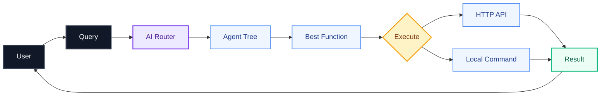
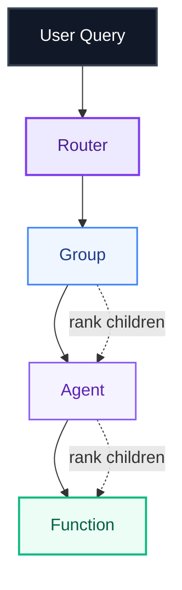
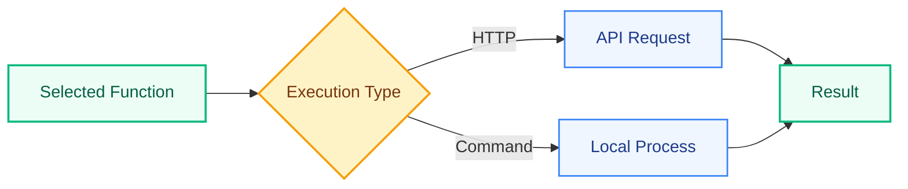
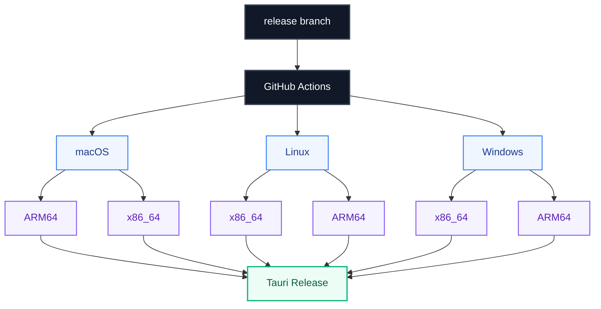

# QuickTasks Desktop

**QuickTasks Desktop** is a cross-platform Tauri application for loading a QuickTasks agent definition and performing **local model-backed intelligent routing**.

It combines a native Rust backend, local ONNX model inference, hierarchical function routing, and a desktop UI.

**Web:** https://qiktax.n8271435.workers.dev/

---

## Architecture

QuickTasks turns a natural-language request into a selected function and then executes that function locally or through an HTTP API.



### Core idea

The important design is the separation between **understanding the request**, **routing through the agent hierarchy**, and **executing the selected function**.

---

## Intelligent Routing

Instead of searching a flat list of functions, QuickTasks navigates a hierarchy of groups, agents, and functions.



The router recursively descends through the hierarchy until it reaches a function node.

---

## Semantic Candidate Selection

At each level, QuickTasks creates candidates from the node's name and description, scores the query against those candidates with a **GTE cross-encoder**, and chooses the highest-scoring result.


This gives the router semantic candidate ranking rather than relying only on exact function-name matching.

---

## Function Execution

Once the router reaches a function, the execution layer chooses the appropriate execution path.



The execution layer supports both HTTP requests and local commands, with parameter substitution, headers, request bodies, multipart files, working directories, and optional elevated execution.

---

## Desktop Runtime

The native desktop application is built with **Tauri + Rust**.


The desktop layer initializes the environment, configures runtime paths, starts Tauri, and exposes native commands for the frontend.

### Available commands

```text
init_status
query
load_agent
reload_models
logs
upload_model_file
use_model_file_path
```

---

## Local AI Inference

QuickTasks can keep the routing models local and load them through ONNX Runtime.


This architecture allows the desktop application to work with locally available model assets instead of requiring routing inference to be performed remotely.

---

## Bundled Models

The application is configured to package the `models/` directory as a read-only Tauri resource.

For an offline-ready installer, place these files in the repository:

```text
models/
├── crossencoder/
│   ├── model.onnx
│   └── tokenizer.json
│
└── ner/
    ├── model.onnx
    └── tokenizer.json
```

At runtime, QuickTasks copies bundled model resources into the user's writable application-data directory before loading them.

This avoids attempting to write large model files into an installed application bundle.

If the model files are not bundled, the application can download the default model files on first model load and store them in the same writable application-data directory.

The desktop UI can also point individual model assets directly to existing local files. In that mode, QuickTasks validates the path and loads the ONNX model or tokenizer JSON directly without copying the large file into application data.

---

## Configuration

Environment overrides are supported for testing and managed installations:

```text
QUICKTASKS_MODEL_DIR
QUICKTASKS_BUNDLED_MODEL_DIR

QUICKTASKS_GTE_MODEL_PATH
QUICKTASKS_GTE_TOKENIZER_PATH

QUICKTASKS_GLINER_MODEL_PATH
QUICKTASKS_GLINER_TOKENIZER_PATH

QUICKTASKS_CONFIG
```

---

## Development

Run the desktop application locally with:

```bash
cargo tauri dev
```

---

## Distribution Builds

Build a native installer for the current operating system with:

```bash
cargo tauri build
```

Tauri generates native application bundles for the target operating system.

| Platform | Typical artifacts                            |
| -------- | -------------------------------------------- |
| macOS    | `.app`, `.dmg`                               |
| Windows  | Windows installer artifacts                  |
| Linux    | Linux bundle artifacts supported by the host |

For full distribution coverage, builds are performed on the corresponding target platforms.

---

## Automated Release Pipeline

QuickTasks uses GitHub Actions to build and publish Tauri releases across operating systems and architectures.



Supported release targets include:

```text
macOS ARM64
macOS x86_64

Linux x86_64
Linux ARM64

Windows x86_64
Windows ARM64
```

Releases can be triggered manually or by pushing to the `release` branch.

---

## Windows ARM64 ONNX Runtime

The Windows ARM64 workflow includes a dedicated ONNX Runtime setup.


The workflow downloads the official Windows ARM64 ONNX Runtime release, configures the Rust `ort` build to use the local library, and makes the runtime DLL available for bundling.

---

## Technology

```text
Rust
Tauri
Tokio
ONNX Runtime
GTE Cross-Encoder
GLiNER
Reqwest
GitHub Actions
```

### Engineering Concepts

```text
Local AI Inference
Semantic Routing
Hierarchical Agent Trees
Cross-Encoder Ranking
Native Desktop Applications
HTTP Execution
Local Command Execution
Model Resource Management
Async Rust
Cross-Platform Release Automation
```

---

## Project Highlights

### Local Model-Backed Routing

Routes natural-language queries through a hierarchical agent/function tree using locally available model inference.

### Semantic Function Selection

Uses a GTE cross-encoder to rank candidate nodes and select the most relevant route.

### Hierarchical Agent Architecture

Supports routing through nested `group`, `agent`, and `func` nodes instead of relying on a flat function registry.

### Native Rust Execution

Provides asynchronous HTTP and local command execution through a Rust backend.

### Cross-Platform Desktop AI

Packages the routing engine into a Tauri application targeting Windows, macOS, and Linux.

### Flexible Model Management

Supports bundled models, downloaded models, configured model directories, and direct local model paths.

### Automated Release Engineering

Builds native installers across multiple operating systems and CPU architectures using GitHub Actions.

---

## Resume Project Entry

**QuickTasks Desktop — Rust, Tauri, ONNX Runtime, GTE, GLiNER**

Built a cross-platform Rust/Tauri AI desktop application for local model-backed semantic routing over hierarchical agent and function trees. Implemented GTE cross-encoder ranking for candidate selection, native HTTP and command execution, configurable local ONNX model management, and automated multi-platform Tauri releases across macOS, Linux, and Windows architectures.

---

## Repository


**Project:** QuickTasks Desktop

**Web:** https://qiktax.n8271435.workers.dev/
